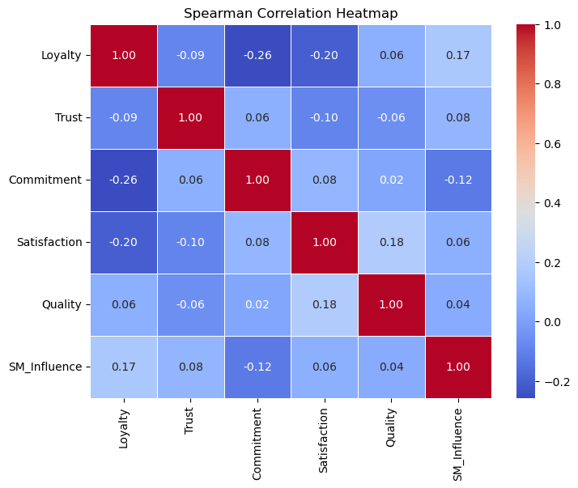
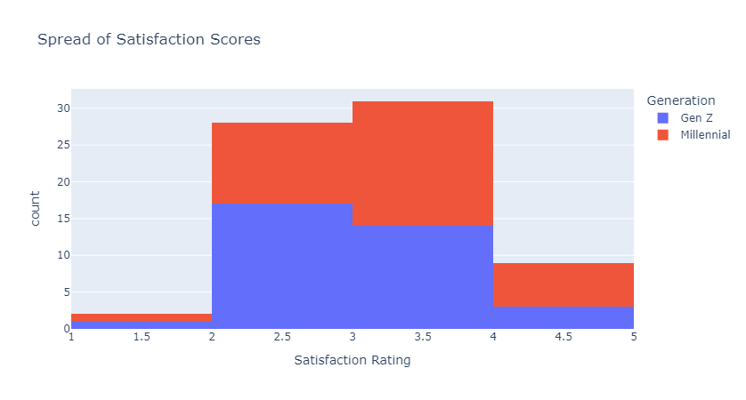
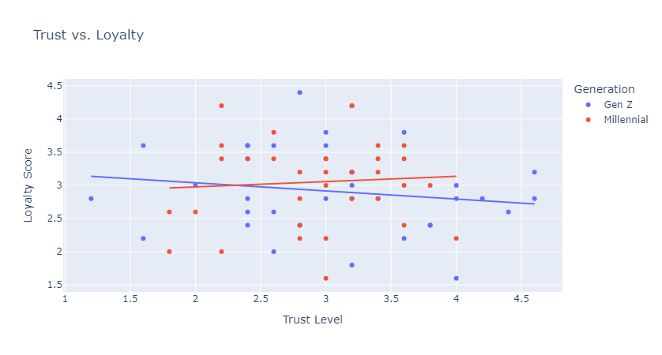
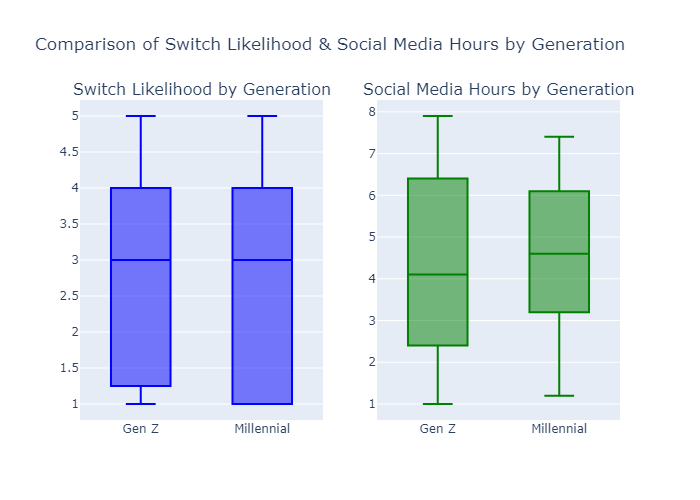

# Brand Loyalty Analysis: Millennials vs. Generation Z

This repository contains the data analysis project conducted as part of my master's research. The project focuses on comparing **brand loyalty patterns between Millennials and Generation Z**, using Python for statistical modeling, visualization, and interpretation.


You are free to use, modify, and distribute this work with proper attribution.

## 📌 Project Overview

The study aimed to:
- Explore how factors such as **trust**, **satisfaction**, **commitment**, and **social media influence** affect brand loyalty.
- Investigate whether **education** and **occupation** influence brand loyalty using Chi-Square tests.
- Compare generational loyalty patterns through **correlation analysis** and **factor analysis**.

## 🧪 Tools & Techniques

- **Python** (Pandas, NumPy, Matplotlib, Seaborn, SciPy)
- **Statistical Methods**: Descriptive analysis, Chi-Square test, correlation analysis, and factor analysis.
- **Data Visualization**: Histograms, scatter plots, and trend lines to support interpretation.

## 🔍 Key Insights

- **Millennials** showed stronger loyalty tied to trust and commitment.
- **Gen Z** loyalty was more influenced by social media and trends.
- Education and occupation **did not significantly** affect loyalty.

## 📁 Repository Structure
```
├── data/ # Raw or simulated dataset

├── analysis/ # Jupyter notebooks or scripts

├── report/ # Final analysis report (PDF or DOCX)

├── visuals/ # Plots and figures

└── README.md

```

## 📈 Sample Visuals

*📍 Spearman Rank Correlation for Population*


*📍 Distribution of Satisfaction Scores*



*📍 Trust vs. Loyalty*



*📍 Switch Likelihood by Generation*



## 📬 Connect With Me

- 📧 Email: [esdraskoome@gmail.com](mailto:esdraskoome@gmail.com)  
- 💼 [LinkedIn](https://www.linkedin.com/in/esdras-koome-micheni-106651338/)  
- 🧑‍💻 [Upwork Profile](https://www.upwork.com/freelancers/~01bbdaff1dc6ce0241)  
- ▶ [YouTube Channel](https://www.youtube.com/channel/UCBhBTBAanuBNiQs3r7mwDmA)

